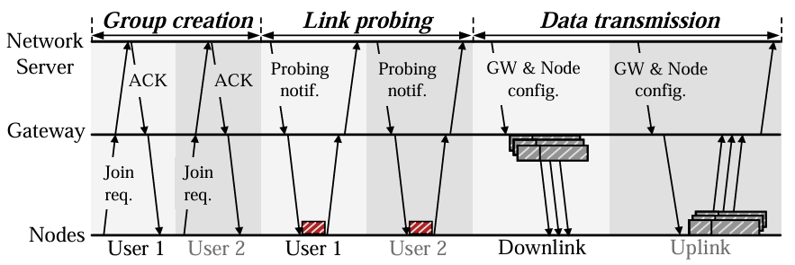

# From Interference Mitigation to Toleration: Pathway to Practical Spatial Reuse in LPWANs
HydraNet can improve spatial reuse and optimize spectrum efficiency in LPWANs.

This webpage contains source code to deploy HydraNet.


## Overview
Low Power Wide-Area Networks (LPWANs) suffer from sever interference due to their long range transmissions. Traditional spatial reuse solutions share a common philosophy, i.e., interference mitigation. 

HydraNet is a new paradigm to facilitate simultaneous LPWAN transmissions on the same frequency,fundamentally evolving the current philosophy of interference management—from mitigating interference to tolerating its presence.

The PDF file is in the main folder.

***Reference:***
*Ruonan Li, Ziyue Zhang, Xianjin Xia, et al. From Interference Mitigation to Toleration: Pathway to Practical Spatial Reuse in LPWANs, ACM MobiCom 2025*. 
## 📌 Hardware Requirements and Dependencies
### Hardware
- LoRa nodes: SX1276 + Arduino Uno (version: 1.8.X)

- Open source gateway: External + USRP N210 with more than 1 antenna (or other Software Defined Radios with equivalent functionality) + GNU Radio Platform

- Data trace processing: A workstation with Matlab (version: R2022a)
### Dependency
*This code is tested on Ubuntu 18.04*.
## HydraNet Spatial Reuse Protocol
Below is the protocol of HydraNet, illustrating how it achieve spatial reuse in LPWANs.

<div align="center">
    
</div>

## 📋 Folders
- **Lora_rf95_server:** We provide .ino (for LoRa COTS node to transmit and receive the probing packets and get the RSS).
  
- **LinkProbing:** We provide .grc (for GNU Radio to get the probing packets) and .m (for Matlab to estimate AoA and get the weight for each path).

- **Uplink** - provide the .grc (for GNU Radio to control the USRP to receive packets) and .m (for Matlab to demodulate) files for uplink opensource gateway process LoRa packets.

- **Downlink** - provide the .grc (for GNU Radio to control the USRP to transmit packets) and .m (for Matlab to generate power beam and combined packets .dat data) files for downlink opensource gateway process LoRa packets.
  
## 🛠 Deploying & Running HydraNet on a LoRa Testbed
### **To Run the Artifact with Provided Data Trace**  

- **Uplink:** We provide two data traces in uplink that reproduce the key functions of HydraNet.

*Open the "Uplink" folder, and run two main files, the detected packets and symbol error number are printed on the command window*.

*(refer to Figure 3 and Figure 5)*.

---
- **Downlink:** We provide data traces in downlink from Arduino monitor that reproduce how to process HydraNet downlink data and provide combined power beam packets generation functions.
*Open the "Downlink" folder, and run two main files, you can get the combined packets with different weight*.


### **To Run the HydraNet on Your Testbed**

## Video Demo

## 📢 Contact & Citation
For questions, open an issue or contact:

- **Ruonan Li** - ruo-nan.li@connect.polyu.hk  
- **Ziyue Zhang** - ziyue.zhang@connect.polyu.hk  

If you use HydraNet in your research, please cite:

```bibtex
@inproceedings{hydranet2025,
  author    = {Ruonan Li and Ziyue Zhang and Xianjin Xia and Ningning Hou and 
               Wenchang Chai and Shiming Yu and Yuanqing Zheng and Tao Gu},
  title     = {From Interference Mitigation to Toleration: Pathway to Practical Spatial Reuse in LPWANs},
  booktitle = {Proceedings of the 31st Annual International Conference on Mobile Computing and Networking (ACM MobiCom ’25)},
  year      = {2025},
  publisher = {ACM},
  location  = {Hong Kong, China},
  doi       = {10.1145/3680207.3723483}
}
